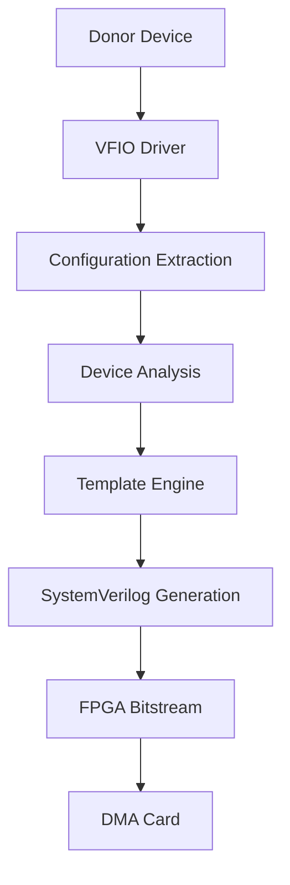

# PCILeech Firmware Generator

## 🔄 CI/CD Status

[](https://github.com/ramseymcgrath/PCILeechFWGenerator/actions/workflows/ci.yml)
[](https://github.com/ramseymcgrath/PCILeechFWGenerator/actions/workflows/ci.yml)
[](https://github.com/ramseymcgrath/PCILeechFWGenerator/actions/workflows/ci.yml)
[](https://github.com/ramseymcgrath/PCILeechFWGenerator/actions/workflows/ci.yml)
[](https://github.com/ramseymcgrath/PCILeechFWGenerator/actions/workflows/ci.yml)
[](https://github.com/ramseymcgrath/PCILeechFWGenerator/actions/workflows/ci.yml)
[](https://github.com/ramseymcgrath/PCILeechFWGenerator/actions/workflows/ci.yml)

## 📊 Quality Metrics

[](https://codecov.io/gh/ramseymcgrath/PCILeechFWGenerator)
[](https://github.com/ramseymcgrath/PCILeechFWGenerator/actions)
[](https://github.com/ramseymcgrath/PCILeechFWGenerator)
[](LICENSE.txt)
[](https://github.com/ramseymcgrath/PCILeechFWGenerator/releases)
[](https://github.com/ramseymcgrath/PCILeechFWGenerator/releases)

## 🏗️ Build Artifacts

[](https://github.com/ramseymcgrath/PCILeechFWGenerator/actions/workflows/ci.yml)
[](https://github.com/ramseymcgrath/PCILeechFWGenerator/actions/workflows/ci.yml)
[](https://github.com/ramseymcgrath/PCILeechFWGenerator/actions/workflows/ci.yml)


Generate authentic PCIe DMA firmware from real donor hardware with a single command. This tool extracts donor configurations from a local device and generates unique PCILeech FPGA bitstreams (and optionally flashes a DMA card over USB-JTAG).

> [!WARNING]
> This tool requires *real* hardware. The templates are built using the device identifiers directly from a donor card and placeholder values are explicitly avoided. Using your own donor device ensures your firmware will be unique.

## 🚀 Quick Start

### Installation

```bash
# Install with TUI support (recommended)
pip install pcileechfwgenerator[tui]

# Load required kernel modules
sudo modprobe vfio vfio-pci
```

### Requirements

- **Python ≥ 3.9**
- **Donor PCIe card** (any inexpensive NIC, sound, or capture card)
- **Linux OS** (You need this)

### Optional Requirements

- **Podman** (_not Docker_ - required for proper PCIe device mounting) You use podman or run the python locally. *You must use linux for either option
- **DMA board** (pcileech_75t484_x1, pcileech_35t325_x4, or pcileech_100t484_x1) You don't need to flash your firmware with this tooling but you can.
- **Vivado Studio** (2022.2+ for synthesis and bitstream generation) You can use a locally generated Vivado project or insert the files into an existing one.

### Basic Usage

```bash
# Interactive TUI (recommended for first-time users)
sudo python3 pcileech.py tui

# CLI interface for scripted builds
sudo python3 pcileech.py build --bdf 0000:03:00.0 --board pcileech_35t325_x1

# CLI build with custom Vivado settings
sudo python3 pcileech.py build --bdf 0000:03:00.0 --board pcileech_35t325_x1 \
    --vivado-path /tools/Xilinx/2025.1/Vivado --vivado-jobs 8 --vivado-timeout 7200

# Check VFIO configuration
sudo python3 pcileech.py check --device 0000:03:00.0

# Flash firmware to device
sudo python3 pcileech.py flash output/firmware.bin

# Check for updates
./cli --check-version

# Skip automatic version check
./cli build --skip-version-check --bdf 0000:03:00.0 --board pcileech_35t325_x1
```

### Development from Repository

```bash
git clone https://github.com/ramseymcgrath/PCILeechFWGenerator.git
cd PCILeechFWGenerator
python3 -m venv .venv && source .venv/bin/activate
pip install -r requirements.txt
sudo -E python3 pcileech.py tui
```

## ✨ Key Features

- **Donor Hardware Analysis**: Extract real PCIe device configurations and register maps from live hardware via VFIO
- **Dynamic Device Capabilities**: Generate realistic network, storage, media, and USB controller capabilities with pattern-based analysis
- **Full 4KB Config-Space Shadow**: Complete configuration space emulation with BRAM-based overlay memory
- **MSI-X Table Replication**: Exact replication of MSI-X tables from donor devices with interrupt delivery logic
- **Deterministic Variance Seeding**: Consistent hardware variance based on device serial number for unique firmware
- **Advanced SystemVerilog Generation**: Comprehensive PCIe device controller with modular template architecture
- **Active Device Interrupts**: MSI-X interrupt controller with timer-based and event-driven interrupt generation
- **Memory Overlay Mapping**: BAR dispatcher with configurable memory regions and custom PIO windows
- **Interactive TUI**: Modern Textual-based interface with real-time device monitoring and guided workflows
- **Containerized Build Pipeline**: Podman-based synthesis environment with automated VFIO setup
- **Automated Testing and Validation**: Comprehensive test suite with SystemVerilog assertions and Python unit tests
- **USB-JTAG Flashing**: Direct firmware deployment to DMA boards via integrated flash utilities

📚 **[Complete Documentation](https://pcileechfwgenerator.ramseymcgrath.com)** | 🔧 **[Troubleshooting Guide](https://pcileechfwgenerator.ramseymcgrath.com/troubleshooting)** | 🏗️ **[Device Cloning Guide](https://pcileechfwgenerator.ramseymcgrath.com/device-cloning)** | ⚡ **[Dynamic Capabilities](https://pcileechfwgenerator.ramseymcgrath.com/dynamic-device-capabilities)** | 🛠️ **[Development Setup](https://pcileechfwgenerator.ramseymcgrath.com/development)**

## 🎯 Use Cases

### 🔬 Security Research
- Penetration testing and red team operations
- Hardware security assessment
- DMA attack research and defense

### 🎓 Educational
- PCIe protocol learning and experimentation
- FPGA development education
- Hardware security training

### 🧪 Development
- PCIe device driver development
- Hardware debugging and analysis
- Custom DMA solution prototyping

## 🏛️ Architecture Overview

The PCILeech Firmware Generator uses a sophisticated multi-layer architecture:



### Core Components

- **[Configuration Space Manager](config-space-shadow.md)**: Handles PCIe config space extraction and emulation
- **[Template Architecture](template-architecture.md)**: Flexible template system for firmware generation
- **[Device Capabilities](dynamic-device-capabilities.md)**: Dynamic PCIe capability detection and implementation
- **[Build System](development.md)**: Automated FPGA project generation and building

## 📋 Requirements

### System Requirements

- **Operating System**: Linux (any modern distribution)
- **Python**: 3.8 or higher (3.9+ recommended)
- **Memory**: 4GB RAM minimum, 8GB recommended
- **Storage**: 2GB free space for build artifacts

### Hardware Requirements

- **Donor PCIe Device**: Any PCIe device for configuration extraction
- **FPGA Board**: pcileech_35t325_x4, pcileech_75t484_x1, or pcileech_100t484_x1
- **USB-JTAG**: For optional FPGA programming

### Software Dependencies

- **VFIO Drivers**: For donor device access
- **Podman** (optional): For containerized builds
- **Xilinx Vivado**: 2022.2+ for synthesis (optional)
- **Git**: For repository management

## 🎯 Supported Devices

The generator supports a wide range of PCIe devices:

- **Network Cards**: Intel, Broadcom, Mellanox
- **Storage Controllers**: NVMe, SATA, SAS
- **Graphics Cards**: NVIDIA, AMD (basic support)
- **Audio Controllers**: Creative, Realtek, Intel HD Audio
- **USB Controllers**: Intel, AMD, NEC
- **Custom Hardware**: Any standard PCIe device

For a complete list, see [Supported Devices](supported-devices.md).

## 🔧 Troubleshooting

Having issues? Check our comprehensive **[Troubleshooting Guide](https://pcileechfwgenerator.ramseymcgrath.com/troubleshooting)** which covers:

- **VFIO Setup Issues** - IOMMU configuration, module loading, device binding
- **Installation Problems** - Package dependencies, container setup
- **BAR Detection Issues** - Power state problems, device compatibility  
- **Device-Specific Issues** - Known problems with specific hardware

Quick diagnostic command:

```bash
# Check VFIO setup and device compatibility
sudo python3 pcileech.py check --device 0000:03:00.0 --interactive
```

## 🔗 Direct Documentation Links

- **[Troubleshooting Guide](https://pcileechfwgenerator.ramseymcgrath.com/troubleshooting)** - Comprehensive troubleshooting and diagnostic guide
- **[Device Cloning Process](https://pcileechfwgenerator.ramseymcgrath.com/device-cloning)** - Complete guide to the cloning workflow
- **[Firmware Uniqueness](https://pcileechfwgenerator.ramseymcgrath.com/firmware-uniqueness)** - How authenticity is achieved
- **[Manual Donor Dump](https://pcileechfwgenerator.ramseymcgrath.com/manual-donor-dump)** - Step-by-step manual extraction
- **[Development Setup](https://pcileechfwgenerator.ramseymcgrath.com/development)** - Contributing and development guide
- **[TUI Documentation](https://pcileechfwgenerator.ramseymcgrath.com/tui-readme)** - Interactive interface guide
- **[Config space info](https://pcileechfwgenerator.ramseymcgrath.com/config-space-shadow)** - Config space shadow info

## 🧹 Cleanup & Safety

- **Rebind donors**: Use TUI/CLI to rebind donor devices to original drivers
- **Keep firmware private**: Generated firmware contains real device identifiers
- **Use isolated build environments**: Never build on production systems
- **Container cleanup**: `podman rmi pcileechfwgenerator:latest`

## 🛡️ Security Considerations

> [!IMPORTANT]
> This tool is intended for educational research and legitimate PCIe development purposes only. Users are responsible for ensuring compliance with all applicable laws and regulations. The authors assume no liability for misuse of this software.

### Best Practices

- Only use on systems you own or have explicit permission to test
- Follow responsible disclosure for any vulnerabilities discovered
- Respect intellectual property and licensing requirements
- Use appropriate safety measures when working with hardware

## 🤝 Community

- **GitHub**: [Issues and Pull Requests](https://github.com/ramseymcgrath/PCILeechFWGenerator)
- **Discord**: Join our community server
- **Documentation**: Comprehensive guides and tutorials

## 🙏 Acknowledgments

- **PCILeech Community**: For feedback and contributions
- @Simonrak for the writemask implementation

## 📄 License

This project is licensed under the MIT License - see the [LICENSE](https://github.com/ramseymcgrath/PCILeechFWGenerator/blob/main/LICENSE.txt) file for details.

## ⚖️ Legal Notice

*AGAIN* This tool is intended for educational research and legitimate PCIe development purposes only. Users are responsible for ensuring compliance with all applicable laws and regulations. The authors assume no liability for misuse of this software.

**Security Considerations:**

- Never build firmware on systems used for production or sensitive operations
- Use isolated build environments (Separate dedicated hardware)
- Keep generated firmware private and secure
- Follow responsible disclosure practices for any security research
- Use the SECURITY.md template to raise security concerns

---

**Ready to get started?** Check out our [Installation Guide](installation.md) or dive into the [Quick Start](quick-start.md) tutorial!
