# PCILeech Firmware Generator

**Generate Authentic PCIe DMA Firmware from Real Donor Hardware**

[](https://github.com/ramseymcgrath/PCILeechFWGenerator/actions/workflows/ci.yml)
[](https://codecov.io/gh/ramseymcgrath/PCILeechFWGenerator)
[](https://github.com/ramseymcgrath/PCILeechFWGenerator)
[](license.md)
[](https://github.com/ramseymcgrath/PCILeechFWGenerator/releases)
[](https://github.com/ramseymcgrath/PCILeechFWGenerator/releases)

The PCILeech Firmware Generator extracts authentic PCIe device configurations from real hardware and generates unique FPGA bitstreams for DMA operations. The tool uses VFIO drivers to access live PCIe devices and creates SystemVerilog firmware that replicates authentic device behavior.

## Key Capabilities

- **Hardware Configuration Extraction** - Extract real PCIe configurations from live hardware via VFIO
- **Unique Firmware Generation** - Generate FPGA bitstreams with authentic device signatures  
- **Direct Board Programming** - Flash firmware to DMA boards via integrated USB-JTAG support
- **Advanced Template System** - SystemVerilog generation with modular template architecture
- **Interactive Interface** - Text-based user interface for guided workflows
- **Complete Config Space** - Full 4KB config-space shadow with BRAM-based overlay
- **MSI-X Support** - Interrupt controller with timer-based event generation
- **Containerized Builds** - Automated build pipeline with VFIO setup

## Quick Installation

```bash
# Install with TUI support (recommended)
pip install pcileechfwgenerator[tui]

# Load kernel modules and start interactive interface
sudo modprobe vfio vfio-pci && sudo python3 pcileech.py tui
```

**[Get Started](quick-start.md)** · **[Documentation](https://pcileechfwgenerator.ramseymcgrath.com)** · **[Troubleshooting](https://pcileechfwgenerator.ramseymcgrath.com/troubleshooting)**

---

## What Makes This Different

| Feature | Traditional Approach | PCILeech FW Generator |
|---------|---------------------|----------------------|
| **Device Identity** | Generic placeholders | Real hardware extraction |
| **Authenticity** | Easily detectable | Unique per-device variance |
| **Config Space** | Limited emulation | Full 4KB shadow with BRAM |
| **Capabilities** | Manual configuration | Dynamic detection & replication |
| **MSI-X Support** | Basic implementation | Exact table replication |
| **Build Process** | Manual setup | Containerized automation |

> **Warning:** This tool requires real donor hardware. Templates use actual device identifiers extracted directly from physical PCIe cards. Using your own donor device ensures your firmware will be completely unique and authentic.

## Advanced Features

### Hardware Analysis
- Real-time VFIO extraction from live PCIe devices
- Complete register map analysis with power state management
- Dynamic capability detection for MSI/MSI-X, PM, PCIe extensions
- Automatic BAR discovery with memory/IO classification
- Vendor-specific quirk handling for maximum compatibility

### Firmware Generation
- Deterministic variance seeding based on device serial numbers
- Pattern-based capability synthesis for realistic network/storage/media controllers
- Advanced SystemVerilog templates with modular architecture
- Memory overlay mapping with configurable PIO windows
- Active interrupt generation with timer-based and event-driven logic

### Development Tools
- Modern text-based user interface with real-time monitoring
- Comprehensive test suites with SystemVerilog assertions
- Automated CI/CD pipeline with multi-platform support
- Containerized build environment with Podman integration
- USB-JTAG flashing utilities for direct deployment

## Supported Hardware

### Donor Devices (Source Hardware)

| Category | Examples | Notes |
|----------|----------|-------|
| **Network Cards** | Intel i210/i350, Broadcom BCM5719, Mellanox ConnectX | Excellent support |
| **Storage Controllers** | NVMe, SATA, SAS controllers | Full BAR extraction |
| **Audio Controllers** | Creative Sound Blaster, Realtek HD Audio | MSI-X replication |
| **USB Controllers** | Intel xHCI, AMD USB 3.0 | Capability detection |
| **Custom Hardware** | Any standard PCIe device | Universal compatibility |

### Target FPGA Boards
- `pcileech_35t325_x4` - Most popular, x4 PCIe slot
- `pcileech_75t484_x1` - Compact x1 form factor  
- `pcileech_100t484_x1` - High-end x1 variant

## Status & Quality

### CI/CD Pipeline Status
[](https://github.com/ramseymcgrath/PCILeechFWGenerator/actions/workflows/ci.yml)
[](https://github.com/ramseymcgrath/PCILeechFWGenerator/actions/workflows/ci.yml)
[](https://github.com/ramseymcgrath/PCILeechFWGenerator/actions/workflows/ci.yml)
[](https://github.com/ramseymcgrath/PCILeechFWGenerator/actions/workflows/ci.yml)
[](https://github.com/ramseymcgrath/PCILeechFWGenerator/actions/workflows/ci.yml)
[](https://github.com/ramseymcgrath/PCILeechFWGenerator/actions/workflows/ci.yml)

### Build Artifacts
[](https://github.com/ramseymcgrath/PCILeechFWGenerator/actions/workflows/ci.yml)
[](https://github.com/ramseymcgrath/PCILeechFWGenerator/actions/workflows/ci.yml)
[](https://github.com/ramseymcgrath/PCILeechFWGenerator/actions/workflows/ci.yml)
[](https://github.com/ramseymcgrath/PCILeechFWGenerator/actions)

## Use Cases

### Security Research

- **Penetration Testing** - Advanced DMA attack vectors for red team operations
- **Hardware Security Assessment** - Analyze PCIe attack surfaces and defenses  
- **Research & Development** - Study hardware-level security mechanisms

### Educational & Training

- **PCIe Protocol Learning** - Hands-on experimentation with real hardware
- **FPGA Development** - Learn SystemVerilog and FPGA design patterns
- **Hardware Security Training** - Understand low-level attack and defense

### Development & Engineering

- **PCIe Driver Development** - Test drivers against realistic hardware behavior
- **Hardware Debugging** - Analyze device behavior and register interactions
- **Custom DMA Solutions** - Prototype specialized DMA implementations

---

## Installation & Setup

### Option 1: Package Installation (Recommended)

```bash
# Install with full TUI support
pip install pcileechfwgenerator[tui]

# Setup and start interactive interface  
sudo modprobe vfio vfio-pci && sudo python3 pcileech.py tui
```

### Option 2: Development Setup

```bash
# Clone and setup development environment
git clone https://github.com/ramseymcgrath/PCILeechFWGenerator.git
cd PCILeechFWGenerator && python3 -m venv .venv && source .venv/bin/activate
pip install -r requirements.txt && sudo -E python3 pcileech.py tui
```

### Option 3: Container Environment

```bash
# Use pre-built container with all dependencies
podman run -it --privileged --device=/dev/vfio/vfio \
  ghcr.io/ramseymcgrath/pcileechfwgenerator:latest
```

**[Complete Installation Guide](quick-start.md)** - Step-by-step setup for all platforms

---

## System Requirements

| Requirement | Minimum | Recommended | Notes |
|-------------|---------|-------------|-------|
| **OS** | Linux (any distribution) | Ubuntu 22.04+ / Fedora 38+ | VFIO support required |
| **Python** | 3.9+ | 3.11+ | Type hints and async support |
| **Memory** | 4GB RAM | 8GB+ RAM | For Vivado synthesis |
| **Storage** | 2GB free | 10GB+ free | Build artifacts and cache |
| **Hardware** | Any PCIe slot | Dedicated test system | Donor device access |

### Essential Commands

```bash
# Check VFIO setup and device compatibility  
sudo python3 pcileech.py check --device 0000:03:00.0 --interactive

# Generate firmware with guided workflow
sudo python3 pcileech.py tui

# Build firmware from command line
sudo python3 pcileech.py build --bdf 0000:03:00.0 --board pcileech_35t325_x4

# Flash generated firmware to DMA board
sudo python3 pcileech.py flash build/pcileech_35t325_x4.bin
```

## Architecture Overview

The PCILeech Firmware Generator employs a sophisticated multi-stage pipeline that transforms real hardware into authentic FPGA firmware:


### Core Technology Stack

| Component | Technology | Purpose |
|-----------|------------|---------|
| **Hardware Interface** | VFIO/UIO Drivers | Direct PCIe device access |
| **Config Extraction** | Python + ctypes | Raw register access & analysis |
| **Template Engine** | Jinja2 + Custom Validators | Dynamic SystemVerilog generation |
| **Build System** | Vivado TCL + Containerization | Automated FPGA synthesis |
| **User Interface** | Textual TUI Framework | Interactive workflow guidance |
| **Testing Framework** | pytest + SystemVerilog Assertions | Comprehensive validation |

### Intelligent Analysis Features

- **Dynamic Capability Detection** - Automatically discovers MSI/MSI-X, Power Management, PCIe extensions
- **Pattern-Based Device Classification** - Identifies network, storage, audio, USB controllers by behavior
- **Register Map Reconstruction** - Builds complete memory layout from BAR analysis  
- **Authenticity Preservation** - Maintains real vendor signatures and hardware quirks
- **Deterministic Variance** - Generates unique firmware while preserving device characteristics

---

## Documentation

| Getting Started | Advanced Topics | Development |
|:---:|:---:|:---:|
| **[Quick Start Guide](quick-start.md)** | **[Device Cloning Process](https://pcileechfwgenerator.ramseymcgrath.com/device-cloning)** | **[Contributing Guide](https://pcileechfwgenerator.ramseymcgrath.com/development)** |
| **[Installation Guide](installation.md)** | **[Config Space Shadow](https://pcileechfwgenerator.ramseymcgrath.com/config-space-shadow)** | **[Testing Framework](https://pcileechfwgenerator.ramseymcgrath.com/testing)** |
| **[TUI Documentation](https://pcileechfwgenerator.ramseymcgrath.com/tui-readme)** | **[Template Architecture](template-architecture.md)** | **[API Reference](https://pcileechfwgenerator.ramseymcgrath.com/api)** |

| Troubleshooting | References | Specialized Guides |
|:---:|:---:|:---:|
| **[Troubleshooting Guide](https://pcileechfwgenerator.ramseymcgrath.com/troubleshooting)** | **[Supported Devices](supported-devices.md)** | **[Dynamic Capabilities](https://pcileechfwgenerator.ramseymcgrath.com/dynamic-device-capabilities)** |
| **[VFIO Setup Issues](https://pcileechfwgenerator.ramseymcgrath.com/vfio-setup)** | **[Fallbacks & Defaults](fallbacks.md)** | **[Firmware Uniqueness](https://pcileechfwgenerator.ramseymcgrath.com/firmware-uniqueness)** |
| **[Finding Missing Values](finding-missing-values.md)** | **[Manual Donor Dump](https://pcileechfwgenerator.ramseymcgrath.com/manual-donor-dump)** | **[Advanced SystemVerilog](https://pcileechfwgenerator.ramseymcgrath.com/systemverilog)** |

---

## Troubleshooting & Support

### Common Issues & Quick Fixes

| Issue | Quick Check | Solution |
|-------|-------------|----------|
| **VFIO not detected** | `lsmod \| grep vfio` | Load modules: `sudo modprobe vfio vfio-pci` |
| **Permission denied** | `ls -la /dev/vfio/` | Add user to vfio group or use sudo |
| **Device binding fails** | `lspci -k` | Unbind driver: `echo [BDF] > /sys/bus/pci/drivers/[driver]/unbind` |
| **Build errors** | Check container logs | Use containerized build: `podman run ...` |

### Get Help & Support

- **Found a bug?** → [Open an Issue](https://github.com/ramseymcgrath/PCILeechFWGenerator/issues/new/choose)
- **Check docs?** → [Full Documentation](https://pcileechfwgenerator.ramseymcgrath.com)
- **Quick diagnostic** → `sudo python3 pcileech.py check --device [BDF] --interactive`

---

## Security & Legal Considerations

> **Important:** This tool is designed for educational research, security testing, and legitimate development purposes. Users must ensure compliance with all applicable laws and regulations.

### Security Best Practices

- **Isolated Testing** - Never use on production systems or networks
- **Private Firmware** - Generated firmware contains real device signatures  
- **Legal Compliance** - Ensure proper authorization for all testing activities
- **Responsible Disclosure** - Report vulnerabilities through proper channels
- **Data Protection** - Secure handling of extracted device configurations

### Safety Guidelines

- **Use dedicated hardware** for donor device extraction
- **Backup original firmware** before flashing DMA boards
- **Follow proper ESD procedures** when handling hardware
- **Keep generated firmware secure** and never share publicly
- **Use containerized builds** to isolate build environments

---

## Community & Contributions

### Join Our Community

- **GitHub** - [Issues & Pull Requests](https://github.com/ramseymcgrath/PCILeechFWGenerator)
- **Documentation** - Comprehensive guides and tutorials
- **Research** - Share findings and improvements

### Ways to Contribute

- **Bug Reports** - Help us identify and fix issues
- **Feature Requests** - Suggest new capabilities  
- **Documentation** - Improve guides and examples
- **Testing** - Validate on new hardware platforms
- **Code** - Submit patches and enhancements

### Acknowledgments

- **PCILeech Community** - Feedback, testing, and contributions
- **@Simonrak** - Advanced writemask implementation
- **Security Researchers** - Responsible vulnerability reporting
- **Hardware Vendors** - Indirect support through public documentation

---

## License & Copyright

This project is licensed under the **MIT License** - see [license.md](license.md) for complete details.

### Legal Notice

This software is provided for **educational and research purposes only**. Users are responsible for:

- Ensuring compliance with local and international laws
- Obtaining proper authorization for security testing  
- Respecting intellectual property rights
- Following responsible disclosure practices
- Using appropriate safety measures with hardware

**The authors assume no liability for misuse of this software.**

---

## Ready to Get Started?

**[Quick Start Guide](quick-start.md)** · **[Installation](installation.md)** · **[Troubleshooting](https://pcileechfwgenerator.ramseymcgrath.com/troubleshooting)**

---

## 🏛️ **Architecture Deep Dive**

The PCILeech Firmware Generator employs a sophisticated multi-stage pipeline that transforms real hardware into authentic FPGA firmware:



```mermaid
graph TD
    A[💾 Donor PCIe Device] --> B[🔌 VFIO Driver Interface]
    B --> C[📊 Configuration Extraction Engine]
    C --> D[🔍 Hardware Analysis & Validation]
    D --> E[🎨 Template Engine & Renderer]
    E --> F[⚡ SystemVerilog Generation]
    F --> G[🏗️ FPGA Build Pipeline]
    G --> H[📡 DMA Board Deployment]
    
    style A fill:#e1f5fe
    style H fill:#f3e5f5
    style E fill:#fff3e0
```

### 🔧 **Core Technology Stack**

| Component | Technology | Purpose |
|-----------|------------|---------|
| **Hardware Interface** | VFIO/UIO Drivers | Direct PCIe device access |
| **Config Extraction** | Python + ctypes | Raw register access & analysis |
| **Template Engine** | Jinja2 + Custom Validators | Dynamic SystemVerilog generation |
| **Build System** | Vivado TCL + Containerization | Automated FPGA synthesis |
| **User Interface** | Textual TUI Framework | Interactive workflow guidance |
| **Testing Framework** | pytest + SystemVerilog Assertions | Comprehensive validation |

### 🧠 **Intelligent Analysis Features**

- **🔍 Dynamic Capability Detection** - Automatically discovers MSI/MSI-X, Power Management, PCIe extensions
- **🎯 Pattern-Based Device Classification** - Identifies network, storage, audio, USB controllers by behavior
- **⚡ Register Map Reconstruction** - Builds complete memory layout from BAR analysis  
- **🔒 Authenticity Preservation** - Maintains real vendor signatures and hardware quirks
- **🎲 Deterministic Variance** - Generates unique firmware while preserving device characteristics

---

## 📚 **Comprehensive Documentation Hub**

<div align="center">

| 🚀 **Getting Started** | 🔧 **Advanced Topics** | 🛠️ **Development** |
|:---:|:---:|:---:|
| **[Quick Start Guide](quick-start.md)** | **[Device Cloning Process](https://pcileechfwgenerator.ramseymcgrath.com/device-cloning)** | **[Contributing Guide](https://pcileechfwgenerator.ramseymcgrath.com/development)** |
| **[Installation Guide](installation.md)** | **[Config Space Shadow](https://pcileechfwgenerator.ramseymcgrath.com/config-space-shadow)** | **[Testing Framework](https://pcileechfwgenerator.ramseymcgrath.com/testing)** |
| **[TUI Documentation](https://pcileechfwgenerator.ramseymcgrath.com/tui-readme)** | **[Template Architecture](template-architecture.md)** | **[API Reference](https://pcileechfwgenerator.ramseymcgrath.com/api)** |

| � **Troubleshooting** | 📖 **References** | 🎯 **Specialized Guides** |
|:---:|:---:|:---:|
| **[Troubleshooting Guide](https://pcileechfwgenerator.ramseymcgrath.com/troubleshooting)** | **[Supported Devices](supported-devices.md)** | **[Dynamic Capabilities](https://pcileechfwgenerator.ramseymcgrath.com/dynamic-device-capabilities)** |
| **[VFIO Setup Issues](https://pcileechfwgenerator.ramseymcgrath.com/vfio-setup)** | **[Fallbacks & Defaults](fallbacks.md)** | **[Firmware Uniqueness](https://pcileechfwgenerator.ramseymcgrath.com/firmware-uniqueness)** |
| **[Finding Missing Values](finding-missing-values.md)** | **[Manual Donor Dump](https://pcileechfwgenerator.ramseymcgrath.com/manual-donor-dump)** | **[Advanced SystemVerilog](https://pcileechfwgenerator.ramseymcgrath.com/systemverilog)** |

</div>

---

## 🔧 **Troubleshooting & Support**

### 🚨 **Common Issues & Quick Fixes**

| Issue | Quick Check | Solution |
|-------|-------------|----------|
| **VFIO not detected** | `lsmod \| grep vfio` | Load modules: `sudo modprobe vfio vfio-pci` |
| **Permission denied** | `ls -la /dev/vfio/` | Add user to vfio group or use sudo |
| **Device binding fails** | `lspci -k` | Unbind driver: `echo [BDF] > /sys/bus/pci/drivers/[driver]/unbind` |
| **Build errors** | Check container logs | Use containerized build: `podman run ...` |

### 📞 **Get Help & Support**

- **🐛 Found a bug?** → [Open an Issue](https://github.com/ramseymcgrath/PCILeechFWGenerator/issues/new/choose)
- **📖 Check docs?** → [Full Documentation](https://pcileechfwgenerator.ramseymcgrath.com)
- **🔧 Quick diagnostic** → `sudo python3 pcileech.py check --device [BDF] --interactive`

---

## 🛡️ **Security & Legal Considerations**

> [!IMPORTANT]
> **Ethical Use Only**: This tool is designed for educational research, security testing, and legitimate development purposes. Users must ensure compliance with all applicable laws and regulations.

### 🔒 **Security Best Practices**

- **🏠 Isolated Testing** - Never use on production systems or networks
- **🔐 Private Firmware** - Generated firmware contains real device signatures  
- **⚖️ Legal Compliance** - Ensure proper authorization for all testing activities
- **🤝 Responsible Disclosure** - Report vulnerabilities through proper channels
- **🛡️ Data Protection** - Secure handling of extracted device configurations

### 📋 **Safety Guidelines**

- **Use dedicated hardware** for donor device extraction
- **Backup original firmware** before flashing DMA boards
- **Follow proper ESD procedures** when handling hardware
- **Keep generated firmware secure** and never share publicly
- **Use containerized builds** to isolate build environments

---

## 🤝 **Community & Contributions**

### 🌟 **Join Our Community**

- **📧 GitHub** - [Issues & Pull Requests](https://github.com/ramseymcgrath/PCILeechFWGenerator)
- **📖 Documentation** - Comprehensive guides and tutorials
- **🔬 Research** - Share findings and improvements

### 🎯 **Ways to Contribute**

- **🐛 Bug Reports** - Help us identify and fix issues
- **✨ Feature Requests** - Suggest new capabilities  
- **📝 Documentation** - Improve guides and examples
- **🧪 Testing** - Validate on new hardware platforms
- **💻 Code** - Submit patches and enhancements

### 🙏 **Acknowledgments**

- **PCILeech Community** - Feedback, testing, and contributions
- **@Simonrak** - Advanced writemask implementation
- **Security Researchers** - Responsible vulnerability reporting
- **Hardware Vendors** - Indirect support through public documentation

---

## 📄 **License & Copyright**

This project is licensed under the **MIT License** - see [LICENSE.txt](https://github.com/ramseymcgrath/PCILeechFWGenerator/blob/main/LICENSE.txt) for complete details.

### ⚖️ **Legal Notice**

This software is provided for **educational and research purposes only**. Users are responsible for:

- Ensuring compliance with local and international laws
- Obtaining proper authorization for security testing  
- Respecting intellectual property rights
- Following responsible disclosure practices
- Using appropriate safety measures with hardware

**The authors assume no liability for misuse of this software.**

---

<div align="center">

## 🚀 **Ready to Get Started?**

**[📚 Quick Start Guide](quick-start.md)** · **[📖 Installation](installation.md)** · **[🔧 Troubleshooting](https://pcileechfwgenerator.ramseymcgrath.com/troubleshooting)**

---

*Transform your PCIe hardware knowledge into authentic FPGA firmware today!*

</div>
